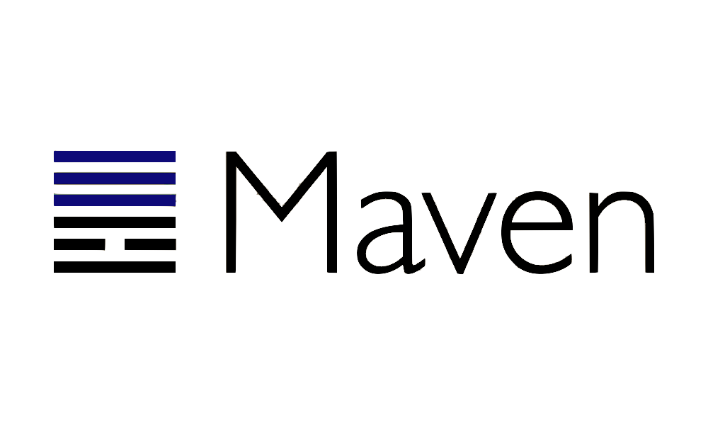

# Yunas private maven parent

[![License][License-Image]][License-Url] 
[![Build][Build-Status-Image]][Build-Status-Url]
[![Gitter][Gitter-image]][Gitter-Url] 

### Description
Maven parent pom contains my plugin bundle and management

[License-Url]: https://www.apache.org/licenses/LICENSE-2.0
[License-Image]: https://img.shields.io/badge/License-Apache2-blue.svg
[github-release]: https://github.com/YunaBraska/maven-parent
[Build-Status-Url]: https://travis-ci.org/YunaBraska/maven-parent
[Build-Status-Image]: https://travis-ci.org/YunaBraska/maven-parent.svg?branch=master
[Coverage-Url]: https://codecov.io/gh/YunaBraska/maven-parent?branch=master
[Coverage-image]: https://codecov.io/gh/YunaBraska/maven-parent/branch/master/graphs/badge.svg
[Version-url]: https://github.com/YunaBraska/maven-parent
[Version-image]: https://badge.fury.io/gh/YunaBraska%2Fmaven-parent.svg
[Central-url]: https://search.maven.org/#search%7Cga%7C1%7Ca%3A%22maven-parent%22
[Central-image]: https://maven-badges.herokuapp.com/maven-central/berlin.yuna/maven-parent/badge.svg
[Maintainable-Url]: https://codeclimate.com/github/YunaBraska/maven-parent
[Maintainable-image]: https://codeclimate.com/github/YunaBraska/maven-parent.svg
[Gitter-Url]: https://gitter.im/nats-streaming-server-embedded/Lobby
[Gitter-image]: https://img.shields.io/badge/gitter-join%20chat%20%E2%86%92-brightgreen.svg
[Javadoc-url]: http://javadoc.io/doc/berlin.yuna/maven-parent
[Javadoc-image]: http://javadoc.io/badge/berlin.yuna/maven-parent.svg